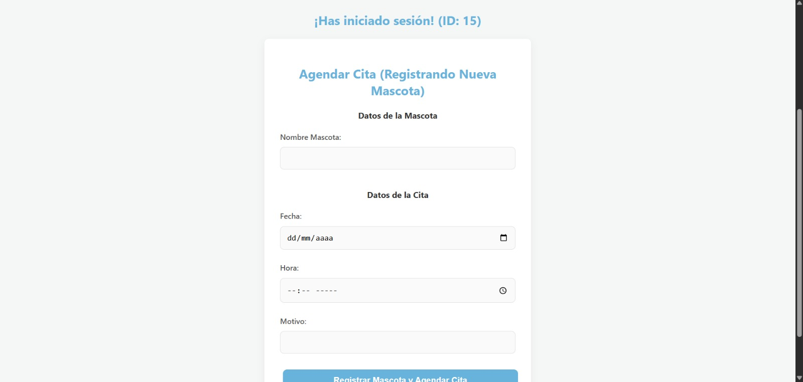

# Proyecto Final: Patitas Felices

Sistema de administración web para gestionar el flujo de trabajo de una clínica veterinaria: pacientes, agenda visual y consultas médicas.

## 🛠️ Tecnologías

* **Frontend:** HTML5, CSS3, JavaScript,React
* **Backend:** Flask (Python)
* **Base de Datos:** Supabase (PostgreSQL)
* **Contenedores:** Docker

### ➕ Gestión de Registros
* Registro de dueños y pacientes (mascotas).
* Formularios dinámicos para historial médico.

### 🔍 Consultas e Informes
* **Agenda Visual:** Programación de citas y recordatorios.
* **Consulta Médica:** Interfaz dedicada para la atención veterinaria en tiempo real.
* **Historial:** Visualización completa de consultas previas.

## 📂 Estructura del Proyecto

```text
├── public/ (o assets/)
│   ├── diagramas/           # Modelos de base de datos
│   └── capturas/            # Imágenes de la interfaz
├── src/
│   ├── components/          # Componentes de la interfaz
│   ├── views/               # Vistas (Registro, Agenda, Consulta)
│   └── services/            # Conexión con Backend/Supabase
└── index.html               # Punto de entrada

### 📊 Modelo de Datos


* **Agenda Visual:** Programación de citas y recordatorios.


### ➕ Gestión de Registros
* Registro de dueños y pacientes (mascotas).

* Formularios dinámicos para historial médico.

* **Consulta Médica:** Interfaz dedicada para la atención veterinaria en tiempo real.


* **Consulta Médica:** Interfaz dedicada para la atención veterinaria en tiempo real.


## 🔗 Enlaces Rápidos

* **Código Fuente:** [Repositorio en GitHub](https://github.com/tu-usuario/patitas-felices)
* **Demo en Vivo (GitHub Pages):** [Patitas Felices](https://tu-usuario.github.io/patitas-felices/)
* **Demo en Vivo (Despliegue Externo):** [Patitas Felices](https://patitas-felices-frontend.vercel.app/)